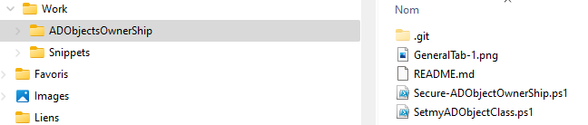
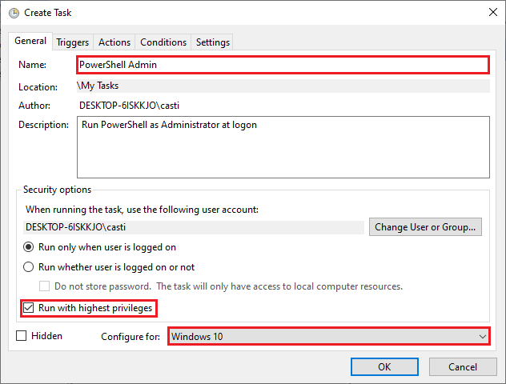

# Secure-ADObjectOwnerShip.ps1
## Requirements
* Script must be run in Administrator.
* Snippets Repository must be available.
* Folder Structure used to build the script:

## In Command Promt
powershell Start-Process powershell -Verb runAs

## In Batch File
Powershell.exe -Command "& {Start-Process Powershell.exe -Verb RunAs}"

## Creating a Scheduled Task to Run PowerShell as Administrator
**Task Scheduler** is a built-in app on Windows 10 that lets you virtually run automated tasks. Hence, you can also use it to create a task that runs PowerShell as administrator each time you logon to your computer, for example.

Start up the **Create Taskbox** and specify the file to run as one of the below:
* For 32-bit OS: C:\Windows\System32\WindowsPowerShell\v1.0\powershell.exe
* For 64-bit OS: C:\Windows\SysWOW64\WindowsPowerShell\v1.0\powershell.exe

In the Create Task windows, provide the values to all of the menu items shown below ensuring the Run with highest privileges checkbox is checked.

Now when the scheduled task is invoked, it will execute PowerShell as administrator!
